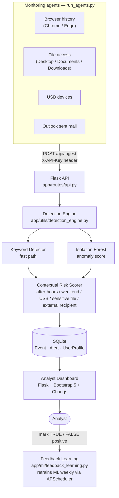
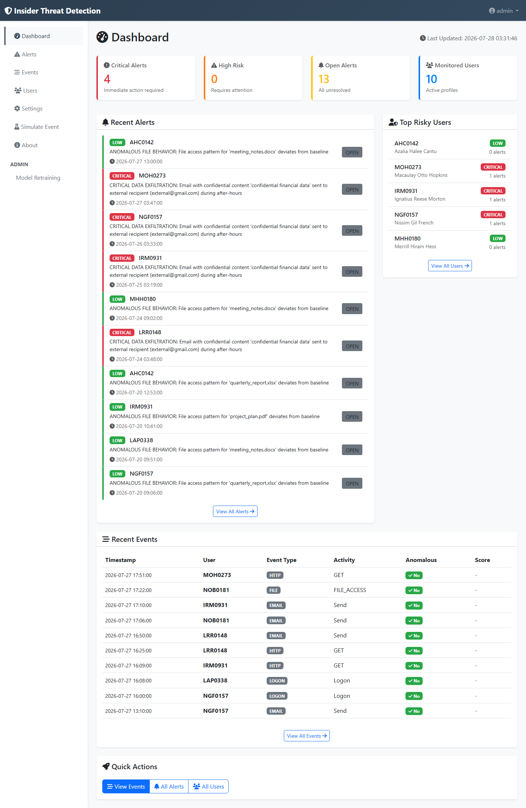
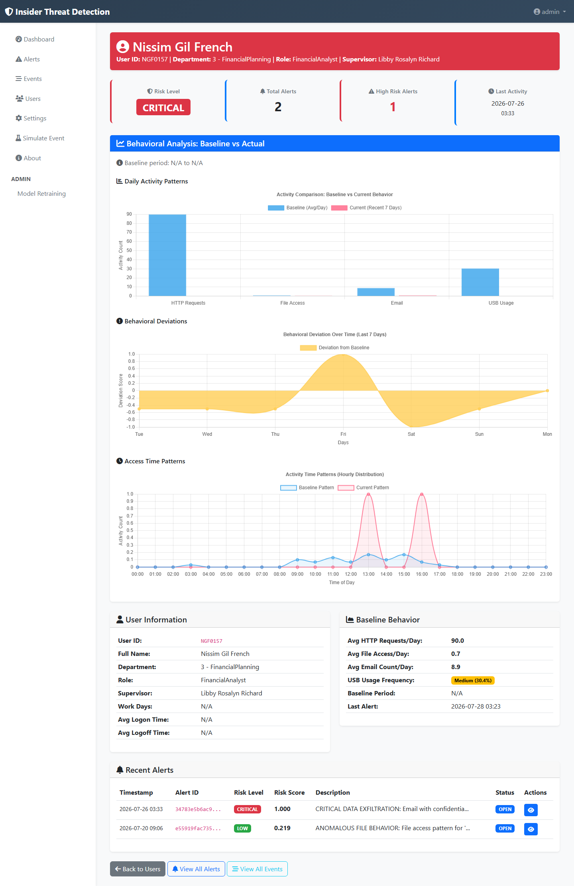
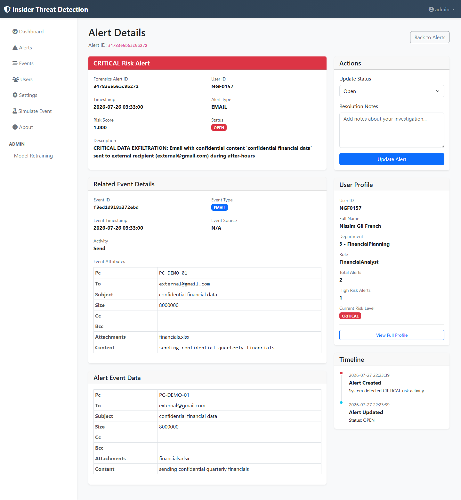
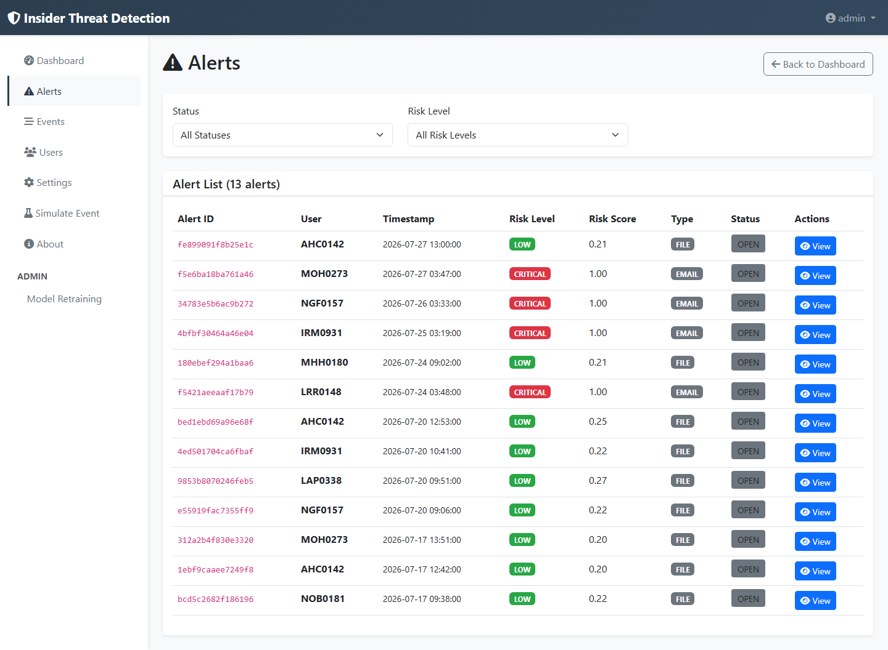
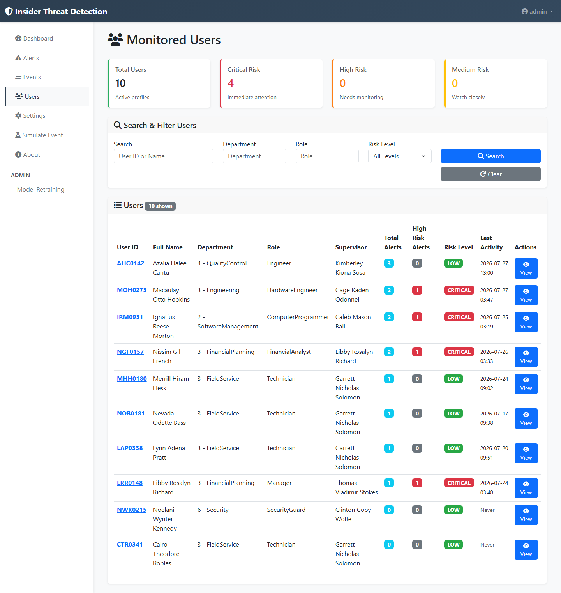
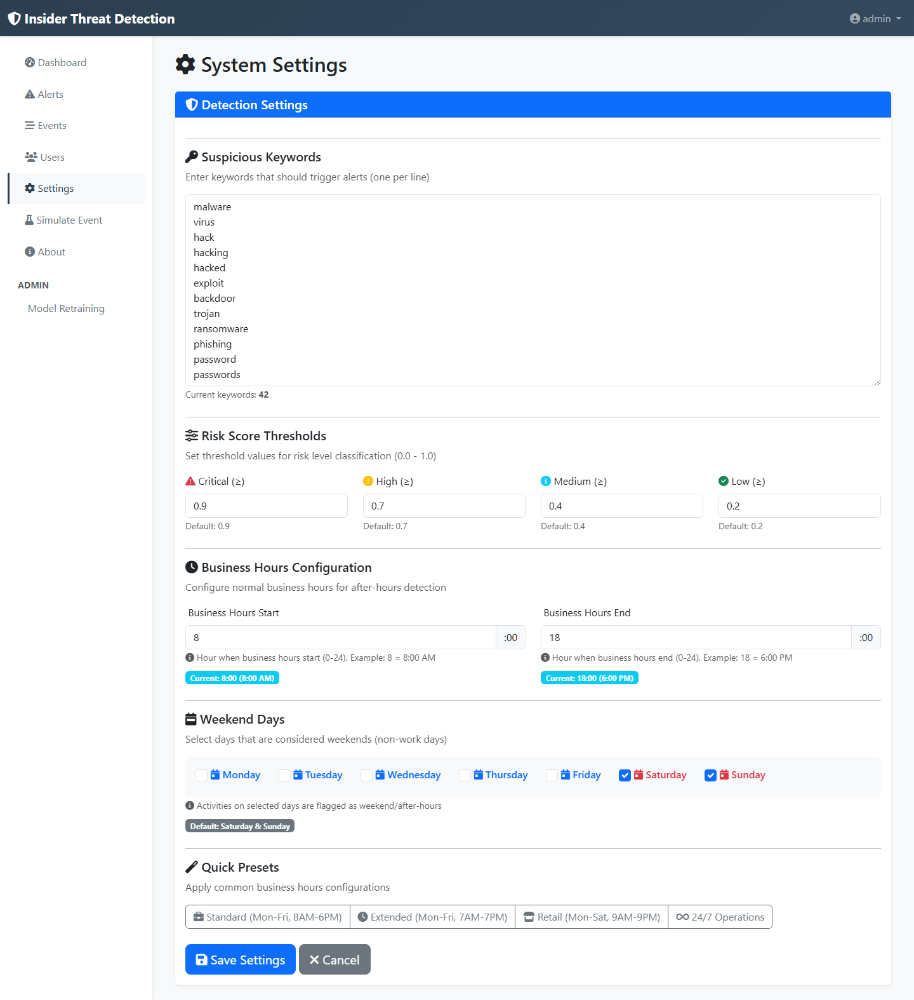
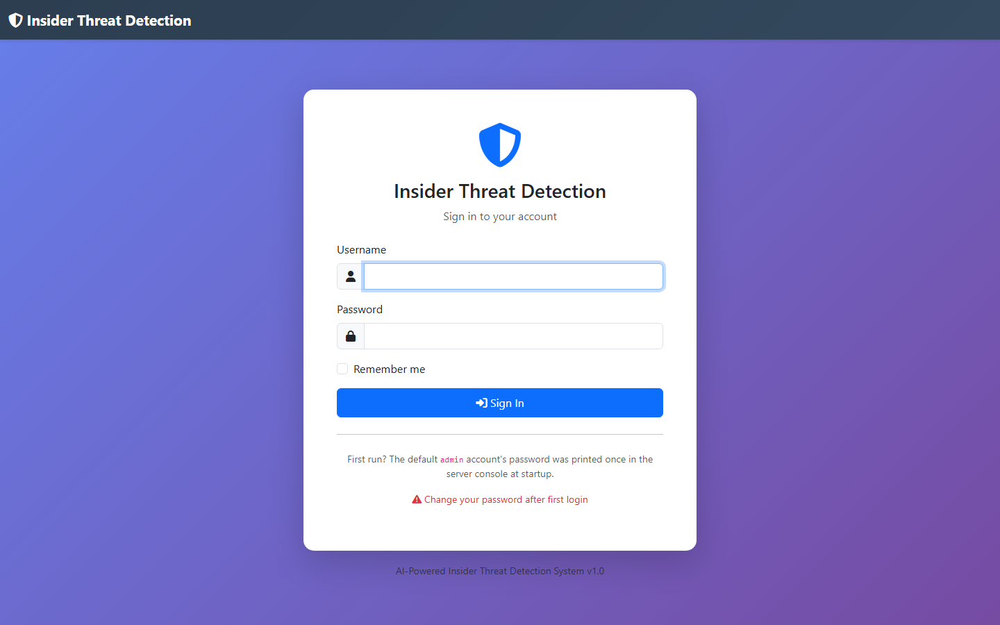

<p align="center">
  
</p>

<h1 align="center">Insider Threat Detection System</h1>

<p align="center">
  A machine-learning-driven UEBA platform that watches logons, web activity, file access,
  USB devices, and email — and turns them into a single, explainable risk score per event.
</p>

<p align="center">
  <a href="https://github.com/AunZulfiqar/Insider-Threat-Detection-System/actions/workflows/ci.yml"></a>
  
  
  <a href="LICENSE"></a>
</p>

---

Built as a final year project. Every event that reaches the system is checked against a
suspicious-keyword list first (fast path), scored for behavioral anomalies by a trained
Isolation Forest, then adjusted for context — after-hours, weekend, USB use, sensitive
filenames, external email recipients, unusual data volume — before an analyst ever sees it.
Trained and evaluated against the **CERT r4.2 insider threat dataset** (Carnegie Mellon
University Software Engineering Institute CERT Division), a public, synthetic dataset of
corporate activity logs with labeled malicious-insider scenarios. *(Link to your exact
dataset citation/DOI here.)*

## Architecture



| Layer | Path | Responsibility |
|---|---|---|
| Entry point | [`run.py`](run.py) | Boots the Flask app and the weekly retrain scheduler |
| App factory | [`app/__init__.py`](app/__init__.py) | Creates the app, wires blueprints, CSRF, login manager |
| Auth | [`app/routes/auth.py`](app/routes/auth.py) | Login, logout, change password |
| Dashboard | [`app/routes/dashboard.py`](app/routes/dashboard.py) | Alerts, events, users, settings, event simulator |
| Ingest API | [`app/routes/api.py`](app/routes/api.py) | `/api/ingest` — API-key-gated event ingestion |
| Detection engine | [`app/utils/detection_engine.py`](app/utils/detection_engine.py) | Orchestrates keyword + ML + contextual scoring |
| ML models | [`app/models/ml_model.py`](app/models/ml_model.py) | `AnomalyDetector`, `KeywordDetector`, `RiskScorer` |
| Behavioral analysis | [`app/utils/behavioral_analysis.py`](app/utils/behavioral_analysis.py) | Baseline-vs-actual chart data per user |
| Feedback learning | [`app/ml/feedback_learning.py`](app/ml/feedback_learning.py) | Retrains from analyst-confirmed alerts |
| Data models | [`app/models/database.py`](app/models/database.py) | SQLAlchemy models: `Event`, `Alert`, `UserProfile`, `User` |
| Monitoring agents | [`run_agents.py`](run_agents.py) | Windows agents: browser, file, USB, email |
| Tests | [`tests/`](tests) | pytest suite: scoring logic + auth/security behavior |
| Demo data | [`seed_demo_data.py`](seed_demo_data.py) | Synthetic events/alerts — no real personal data |

Detection settings (risk thresholds, business hours, suspicious keywords, enable/disable
keyword vs. ML detection) live in `app/config/settings.json` and are edited from the
**Settings** page in the dashboard — the same file the detection engine reads at request
time, so changes take effect immediately without a restart.

## Features

- **Real-time detection pipeline** — keyword fast-path, Isolation Forest anomaly scoring,
  and contextual risk adjustment combine into one explainable score and risk level
  (`NORMAL` → `LOW` → `MEDIUM` → `HIGH` → `CRITICAL`) per event.
- **Analyst dashboard** — alert triage queue, per-user risk profiles with baseline-vs-actual
  behavioral charts, full event history, and a live event simulator to test detection rules
  without waiting on real activity.
- **Feedback learning loop** — analysts mark alerts `FALSE_POSITIVE` or `CLOSED` (confirmed
  threat); a weekly job retrains a supervised classifier and adjusts the anomaly detector
  from that feedback.
- **Monitoring agents** — standalone Windows scripts (`run_agents.py`) that watch real
  browser history (Chrome/Edge), file access (Desktop/Documents/Downloads), USB device
  connects, and sent email (Outlook), and POST structured events to the detection API.
- **Role-based auth, CSRF protection, and API-key-gated ingest** — see
  [Security notes](#security-notes) below.

## Screenshots

All screenshots below are captured against **synthetic demo data** (`seed_demo_data.py`,
built from the public CERT dataset personas) — no real personal data was used.

<p align="center">
  
  <br><em>Dashboard — live counts, recent alerts, and top risky users at a glance</em>
</p>

<details>
<summary><strong>User detail — behavioral analysis (baseline vs. actual)</strong></summary>
<br>

</details>

<details>
<summary><strong>Alert detail — forensics view</strong></summary>
<br>

</details>

<details>
<summary><strong>Alerts queue</strong></summary>
<br>

</details>

<details>
<summary><strong>Monitored users</strong></summary>
<br>

</details>

<details>
<summary><strong>Detection settings</strong></summary>
<br>

</details>

<details>
<summary><strong>Login</strong></summary>
<br>

</details>

## Tech stack

Flask 3 · Flask-SQLAlchemy · Flask-Login · Flask-WTF · SQLite · scikit-learn
(Isolation Forest + Random Forest) · pandas / numpy · APScheduler (weekly
auto-retraining) · Bootstrap 5 + Chart.js · pytest + GitHub Actions CI

## Getting started

```bash
git clone https://github.com/AunZulfiqar/Insider-Threat-Detection-System.git
cd Insider-Threat-Detection-System
python -m venv venv
venv\Scripts\activate          # Windows
# source venv/bin/activate     # macOS/Linux

pip install -r requirements.txt

# Required for anything beyond local experimentation — see Security notes.
set SECRET_KEY=change-me
set AGENT_API_KEY=change-me

python init_database.py        # creates tables + loads user_profiles.csv
                                # (synthetic personas from the public CERT dataset)
                                # prints the randomly generated admin password — save it
python seed_demo_data.py       # synthetic events/alerts so the dashboard isn't empty

python run.py
# → http://localhost:5000, log in as admin with the password printed above
```

To monitor your **own** real activity instead of the seeded demo data, set
`MONITOR_TARGET_EMAIL` to your Outlook address and run `python run_agents.py` in a
separate terminal while `run.py` is running. **Note:** this reads your actual browser
history, filenames, and sent email — it's meant for local experimentation, not for a
shared/public machine, and `instance/*.db` is gitignored for exactly this reason.

## Running tests

```bash
pytest                                       # requirements.txt already includes pytest

# Optional, for a local coverage report / badge (CI does this automatically):
pip install pytest-cov
coverage run -m pytest && coverage report
coverage json -o coverage.json && python scripts/make_coverage_badge.py coverage.json docs/coverage.svg
```

`tests/test_keyword_detector.py` and `tests/test_risk_scorer.py` cover the core scoring
logic directly (no Flask app needed). `tests/test_auth_and_security.py` covers
auth/CSRF/API-key behavior against a temporary throwaway database. CI runs the full suite
on every push via [`.github/workflows/ci.yml`](.github/workflows/ci.yml) and regenerates
the coverage badge above automatically.

## Security notes

- `SECRET_KEY` and `AGENT_API_KEY` ship with dev-only placeholder defaults —
  **set both via environment variables before deploying anywhere beyond localhost.**
- The default admin password is randomly generated on first run and printed once to the
  console (or set `ADMIN_PASSWORD` yourself before first run).
- `/api/ingest` and `/api/receive-log` require the `X-API-Key` header to match
  `AGENT_API_KEY` — this is what the agent scripts authenticate with.
- All dashboard forms are CSRF-protected (Flask-WTF).
- `instance/` (the real database) is gitignored — never commit it, since `run_agents.py`
  can populate it with real personal browsing/file/email data if you run it against your
  own machine.

## Known limitations / future work

- Detection settings load from `app/config/settings.json` via three separate loader
  functions (`detection_engine.py`, `ml_model.py`, `dashboard.py`) — works correctly today
  but should be consolidated into one shared module.
- No rate limiting or account lockout on the login form.
- The feedback-learning whitelist (auto-suppressing confirmed false positives) is
  scaffolded but not yet wired to real pattern matching.
- Dependency versions should be reviewed and bumped periodically; CI pins Python 3.13 and
  installs from `requirements.txt` on every run, so a version drift will surface quickly.

## License

MIT — see [LICENSE](LICENSE).
